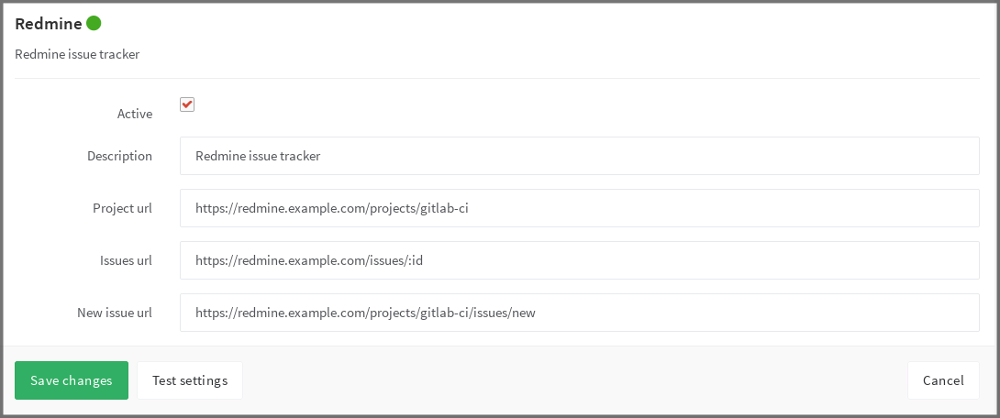

# Redmine Service

To enable the Redmine integration in a project, navigate to the
[Integrations page](project_services.md#accessing-the-project-services), click
the **Redmine** service, and fill in the required details on the page as described
in the table below.

| Field | Description |
| ----- | ----------- |
| `description`   | A name for the issue tracker (to differentiate between instances, for example) |
| `project_url`   | The URL to the project in Redmine which is being linked to this GitLab project |
| `issues_url`    | The URL to the issue in Redmine project that is linked to this GitLab project. Note that the `issues_url` requires `:id` in the URL. This ID is used by GitLab as a placeholder to replace the issue number. |
| `new_issue_url` | This is the URL to create a new issue in Redmine for the project linked to this GitLab project |

Once you have configured and enabled Redmine:

- the **Issues** link on the GitLab project pages takes you to the appropriate
  Redmine issue index
- clicking **New issue** on the project dashboard creates a new Redmine issue

As an example, below is a configuration for a project named gitlab-ci.

